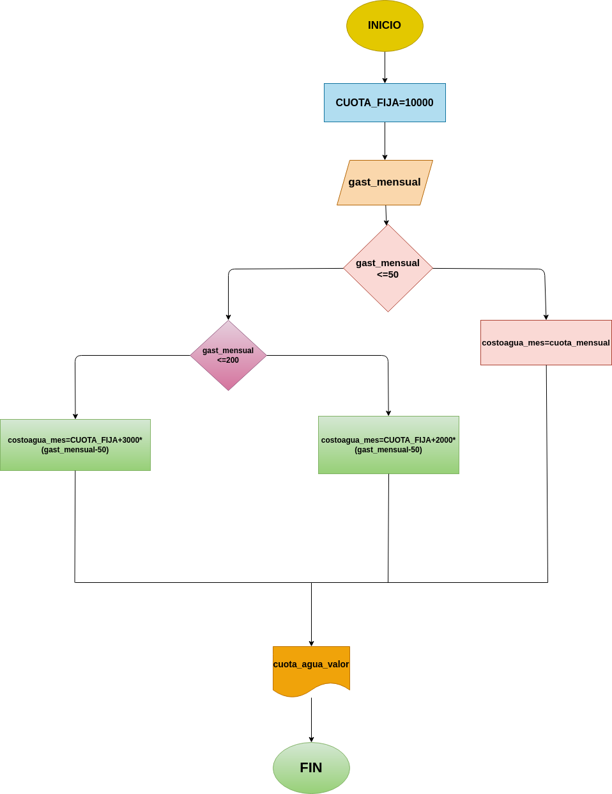

#Programa que calcula el gasto de agua de una vivienda dado el número de m3 de agua gastados, siendo el sistema de cobro el siguiente:

• La cuota fija mensual es de $10000.

• Los primeros 50 m2 son gratis.

• Entre 50 y 200 m2 se cobra el m2 a $2000.

• A partir de 200 m2 se cobra el m2 a $3000.

#Diagrama de flujo

